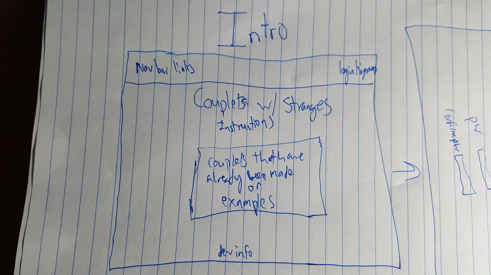
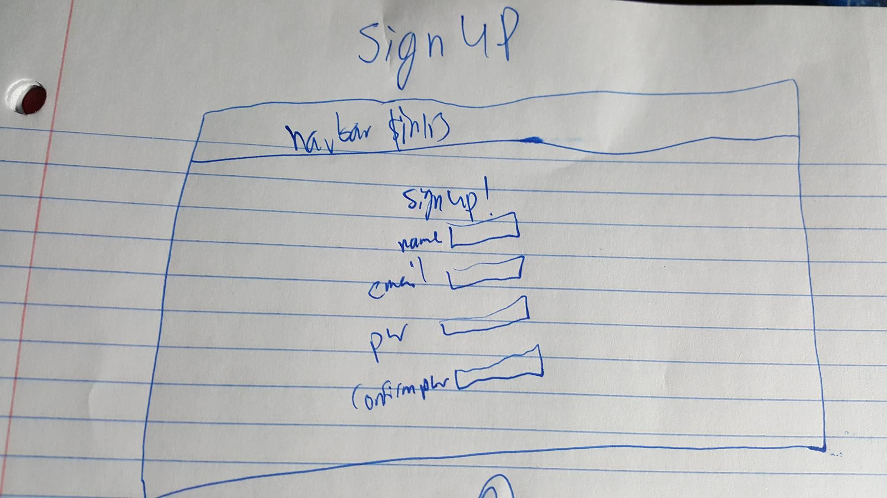
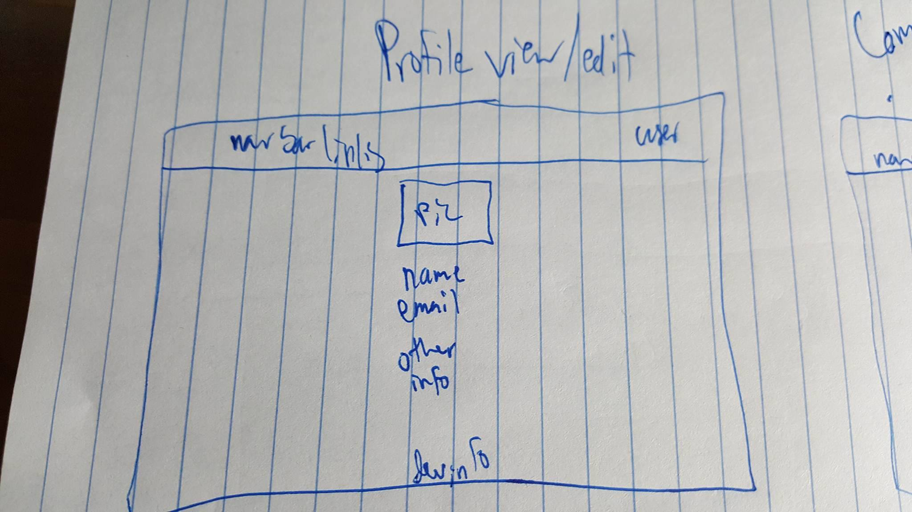
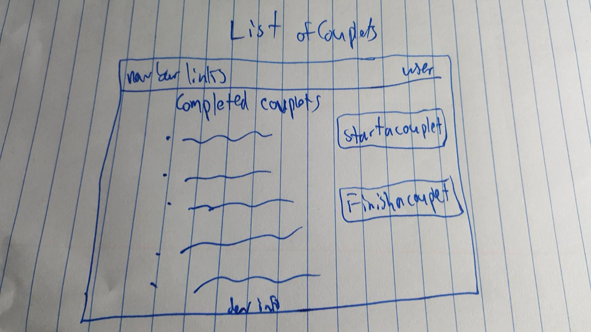
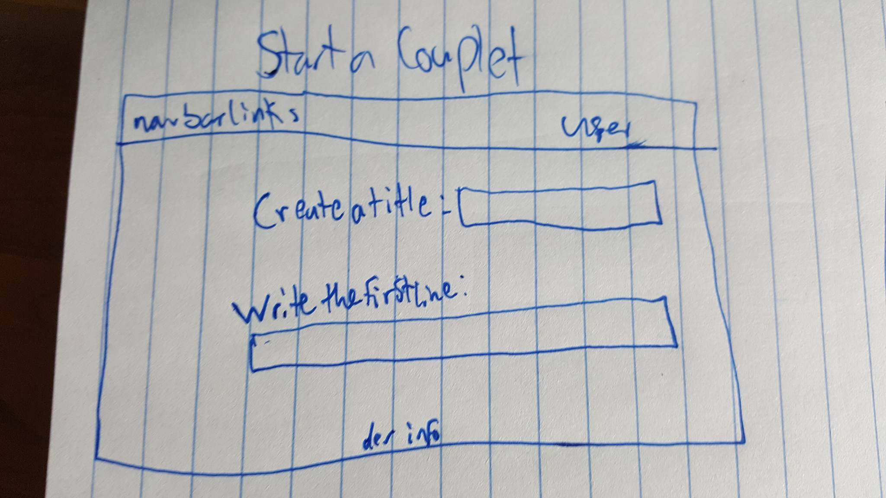
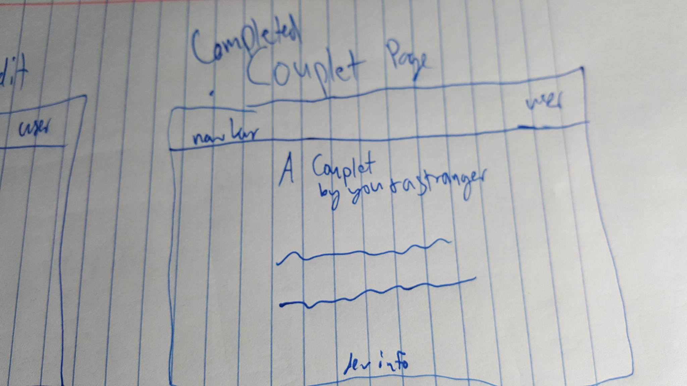
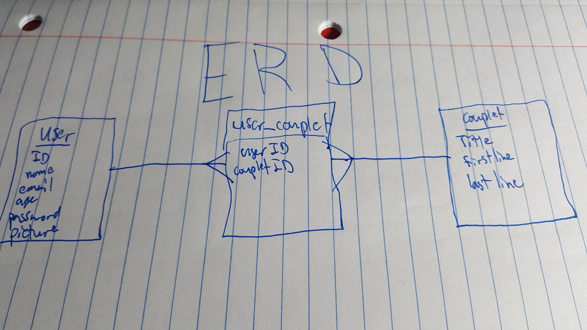

# Couplets with Strangers

Start your own couplet or finish one that someone has started! The trick is that the person finishing it only knows the last word of the first sentence to know what they should try and rhyme with.  

# MVP:

A person should be able to open the website and click a sign up button that takes them to a page where they can successfully input their information that they can use as log in information if they choose to log in at a later point in time.  Once signed up and automatically logged in upon completion of sign up, a user should be redirected to the home page where they can click to see the list of already completed couplets or click a link in a nav bar to go straight to creating or completing a couplet.  A user should also be able to view their profile as well as edit their information and be able to upload a picture.

[trello](https://trello.com/b/3JB6dJma/wdi-sm-43-project-1)

# Wireframes:

# ERD:

