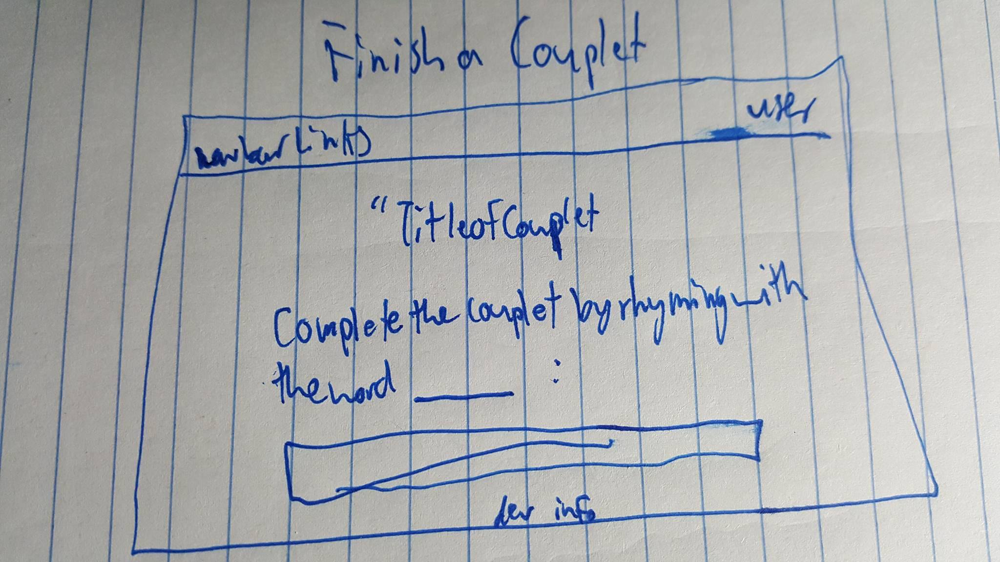

# Couplets for Friends

Old:
Start your own couplet or finish one that someone has started! The trick is that the person finishing it only knows the last word of the first sentence to know what they should try and rhyme with.  

New:
Always wanted to explore your creative side but never had a quick and easy outlet to do it? Couplets for Friends allows you to be creative in two sentences! Sign up and start creating your own quick poems or scroll the feed to see what other people have created.

# Before Project MVP:

A person should be able to open the website and click a sign up button that takes them to a page where they can successfully input their information that they can use as log in information if they choose to log in at a later point in time.  Once signed up and automatically logged in upon completion of sign up, a user should be redirected to the home page where they can click to see the list of already completed couplets or click a link in a nav bar to go straight to creating or completing a couplet.  A user should also be able to view their profile as well as edit their information and be able to upload a picture.

#True MVP:
A person is able to sign up with a user name, email, and password and create their own couplets with an attached image and be able to go back after creating it to edit any part of it they would like or delete it all together.  Only the owner of the couplet has this feature. A user can also comment on their own or other users couplets. Only the owner of the comment can edit or delete it.  The user lastly has the ability to add a picture and bio to their profile, that only they can edit, and users can view other users profiles and see their most recent couplets.

#Approach Taken:
My approach was to start by anyone being able to create their own couplet with an image they could upload attached to it. From their I added the user functionality and authorization so that only a person who made the couplet could edit it. This also includes a user being the only one able to edit their profile and account (except for anyone who has admin status which is set to default automatically whenever someone signs up). The last feature before styling the website was to add comments to the couplets that the owner of the comment could edit or delete.

#Unsolved Issues:
With more time I would like to make the feature of users being able to collaborate and have one person write the first line and a second person write the last line. Also would like to add it so the owner of a couplet can delete other peoples' comments on their couplet that they disapprove of.

## Technology used:
 - ruby on rails
 - HEROKU
 - html
 - scss/bootstrap
 - HTML5
 - PostgreSQL
 - AWS/paperclip

## Installation
  1. Clone the repo
  2. Use the terminal to cd into the project folder then: bundle install followed by rails db:create followed by rails db:migrate
  3. Type 'rails s' in terminal to start terminal.
  4. In your browser open: localhost:3000.

[trello](https://trello.com/b/3JB6dJma/wdi-sm-43-project-1)

# Wireframes:

# ERD:

